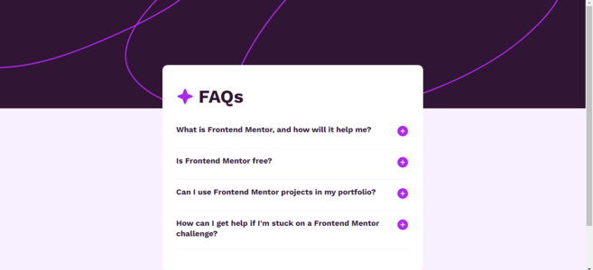
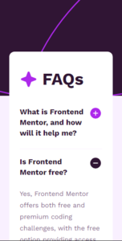

<h1 align='center'>FAQ Accordion Main - Front End Mentor</h1>

<p align="center">
  <a href="#-sobre">Sobre</a>&nbsp;&nbsp;&nbsp;|&nbsp;&nbsp;&nbsp;
  <a href="#-layout">Layout</a>&nbsp;&nbsp;&nbsp;|&nbsp;&nbsp;&nbsp;
  <a href="#-tecnologias-e-ferramentas">Tecnologias e Ferramentas</a>&nbsp;&nbsp;&nbsp;|&nbsp;&nbsp;&nbsp;
  <a href="#-como-usar">Como usar</a>&nbsp;&nbsp;&nbsp;|&nbsp;&nbsp;&nbsp;
  <a href="#-licença">Licença</a>&nbsp;&nbsp;&nbsp;|&nbsp;&nbsp;&nbsp;
</p>

<p align="center">
    ✔ Projeto concluído
</p>

<hr/>


## ❓ Sobre

Este projeto faz parte de uma desafio da plataforma **FrontEnd Mentor**. 
A aplicação consiste basicamente de uma página com um card interativo. Aqui está o [link](https://www.frontendmentor.io/challenges/blog-preview-card-ckPaj01IcS) para a página do desafio. 


## 🎨 Layout

 


## 🛠 Tecnologias e Ferramentas

- [ReactJS](https://react.dev/)
- [SASS](https://sass-lang.com/)
- [TypeScript](https://www.typescriptlang.org/)
- [VsCode](https://code.visualstudio.com/)


## 💻 Como usar

Antes de continuar, é recomendado possuir alguns conhecimentos básicos de [HTML5](https://developer.mozilla.org/pt-BR/docs/Web/HTML), [CSS3](https://developer.mozilla.org/pt-BR/docs/Web/HTML), [JavaScript](https://www.javascript.com/) e [ReactJS](https://react.dev/) para entender os códigos do projeto. 
Além disso, você precisa ter instalado em sua máquina o [GIT](https://git-scm.com/), [Node](https://nodejs.org/en) e um **editor de texto** de sua preferência. Recomendo sempre o [Visual Studio Code](https://code.visualstudio.com/). 

Um guia básico sobre como instalar e executar o projeto na sua máquina local: 

1. Clone o projeto ou faça download do ZIP: 

```bash
    # abra o terminal (Git bash) e digite 
    # não precisa fazer isso se já tiver feito download do projeto (nesse caso, só extraia a pasta e entre nela)
    $ git clone https://github.com/Gustavo-Victor/faq-accordion-main.git
```

2. Entre na pasta do projeto:

```bash
    $ cd faq-accordion-main/
```

3. Instale as dependências:

```bash
    $ yarn
```

4. Execute a aplicação:

```bash
    $ yarn dev
```

5. Abra o projeto no seu navegador de preferência:
    - Digite no seu navegador o URL: http://localhost:5173/

<hr/>


## 📝 Licença 

O projeto está sob a Licensa MIT 

Qualquer pessoa pode usar, clonar e contribuir com este projeto. 

Clique [aqui](./LICENSE) para saber mais  


